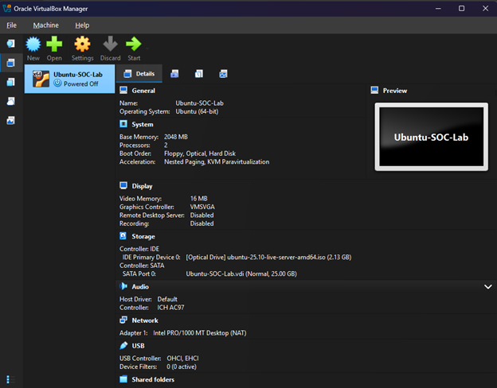
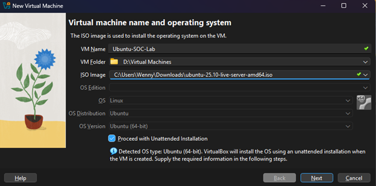
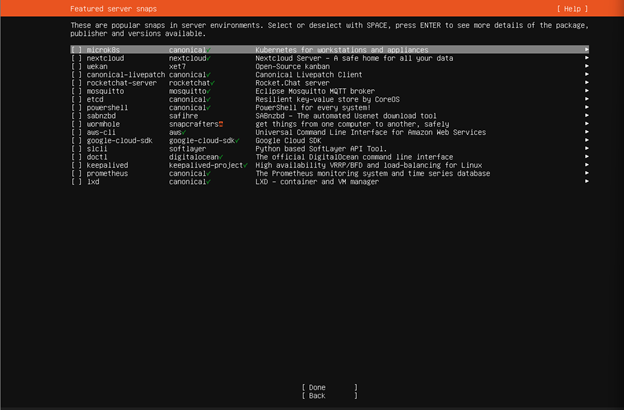
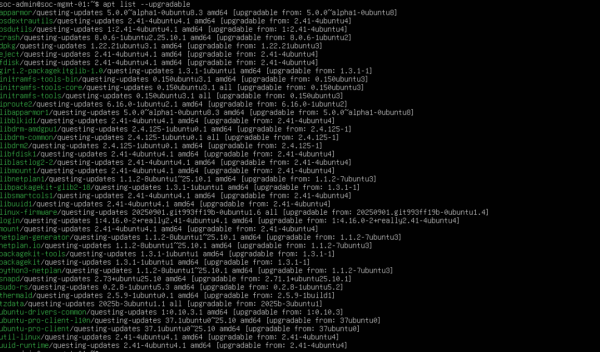

# Building a Secure Virtualized Network Environment

**Author:** Wennymar Aguil  
**Date:** January 2026  
**Category:** Virtualization / Systems Administration / Security Foundations

---

## 1. Executive Summary
The goal of this project was to design and deploy a controlled laboratory environment using Oracle VM VirtualBox. This lab serves as a secure "sandbox" to practice network monitoring, patch management, and security testing without risking the host machine's integrity. By configuring a Linux-based server (Ubuntu) alongside a Windows client, I established a cross-platform environment for analyzing system telemetry and practicing SOC Analyst workflows.

## 2. Tools & Technologies
* **Hypervisor:** Oracle VM VirtualBox 7.2.4
* **Operating System:** Ubuntu Server 25.10 (Linux)
* **Secondary OS:** Windows 10/11 (Evaluation ISO)
* **Networking:** VirtualBox NAT Network (10.0.2.0/24)
* **Maintenance:** Revo Uninstaller (System Cleanup)
* **Documentation:** Markdown

---

## 3. Implementation & Troubleshooting Logs

### 📅 Activity Log: January 18, 2026
**Technical Challenge: VirtualBox Installation Failure**
During the initial deployment, the Oracle VirtualBox 7.2.4 installer failed with a generic "Fatal error".

* **Investigation:** The failure was traced to an attempt to install core software on a secondary storage drive, which triggered security and permission conflicts.
* **System Remediation:** Utilized **Revo Uninstaller** to remove partial installation files and purge orphaned registry entries to ensure a clean state.
* **Resolution:** Reinstalled the hypervisor using the default `C:\Program Files` path with elevated **Administrative privileges**, which successfully bypassed the previous directory requirements.

---

### 📅 Activity Log: January 28, 2026
**Phase: Virtual Machine Provisioning & Storage Optimization**

#### **1. Virtual Machine Configuration (Ubuntu-SOC-Lab)**
* **Name:** `Ubuntu-SOC-Lab`
* **Resource Allocation:** 2048 MB RAM | 2 Virtual CPUs | 25.00 GB VDI
* **ISO Image:** `ubuntu-25.10-live-server-amd64.iso`
* **Reference Image:** 

#### **2. Storage Architecture & Path Redirection**
* **Challenge:** Observed that "Network" management options were restricted due to the initial installation path configuration.
* **Action:** Accessed Global Preferences and redirected the **Default Machine Folder** to `D:\Virtual Machines`.
* **Outcome:** Resolved UI visibility issues and ensured high-volume VM data is stored on secondary storage, preserving the integrity of the primary system drive.
* **Reference Image:** 

#### **3. OS Installation & Secure Implementation**
* **Principle of Least Functionality:** During the Ubuntu installation, I deliberately bypassed all "Featured Server Snaps" (e.g., AWS-CLI, PowerShell). This minimizes the attack surface by ensuring only essential services are running on the management server.
* **Identity Management:** Configured a professional naming convention with the hostname `soc-mgmt-01` and a dedicated `soc-admin` profile.
* **Post-Install Fix:** Resolved a `cdrom.mount` failure during the first reboot by manually forcing the ejection of the virtual ISO via hypervisor settings.
* **Reference Image:** 

#### **4. Post-Deployment Hardening**
* **Patch Management:** Logged into the new system and immediately ran `sudo apt update` and `sudo apt upgrade -y`.
* **Verification:** Confirmed that critical system packages (including `apparmor`, `linux-firmware`, and `snapd`) were patched to mitigate "Day 0" security risks.
* **Reference Image:** 

---

## 4. Key Takeaways for SOC Documentation
* **Standardize Installation Paths:** Core hypervisor software should be installed on the primary OS drive for stability, while VM images (.vdi) are moved to secondary storage to manage disk capacity.
* **Least Functionality:** Reducing the initial software footprint is a fundamental security hardening step.
* **Log Analysis:** When installers fail, checking the specific error logs allows for data-driven troubleshooting rather than trial-and-error.
