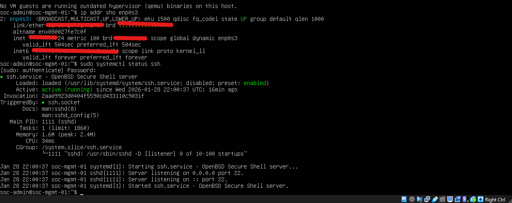

# Project Implementation & Troubleshooting Logs

### 📅 Activity Log: January 18 - 29, 2026
**Phase: Hypervisor Deployment & Virtual Infrastructure Provisioning**

#### 1. Hypervisor Installation & Remediation
* **Technical Challenge:** Initial Oracle VirtualBox 7.2.4 installation failed with a "Fatal error" due to directory permission conflicts on a secondary drive.
* **System Remediation:** Utilized **Revo Uninstaller** to purge orphaned registry entries and partial files, followed by a clean install to `C:\Program Files` with elevated Administrative privileges.
* **Optimization:** Redirected the **Default Machine Folder** to `D:\Virtual Machines` to preserve primary drive performance while allowing for scalable VM growth.

#### 2. Network Infrastructure (Lab Subnet)
* **Action:** Created a dedicated **NAT Network** named `SOC-Lab-Network`.
* **Configuration:** Assigned the `10.0.2.0/24` IPv4 prefix with DHCP enabled.
* **Evidence:** [Network Config](../images/vbox-nat-network-setup.png)
* **SOC Rationale:** Isolating lab traffic from the host OS is a fundamental security practice for malware analysis and network monitoring.

#### 3. Management Server Provisioning (soc-mgmt-01)
* **Resource Allocation:** Provisioned an Ubuntu Server VM with 2 vCPUs, 2048 MB RAM, and a 25.00 GB VDI hard disk.
* **Network Binding:** Bound the primary network adapter to the `SOC-Lab-Network` interface.

#### 4. Storage Sanitization & Risk Mitigation
* **Troubleshooting:** Identified a potential "Unattended Installation" script (aux-iso) that would have created a generic `vboxuser` account.
* **Action:** Manually detached the automated ISO and mounted `ubuntu-25.10-live-server-amd64.iso` to the IDE controller.
* **Critical Incident:** Successfully identified and bypassed a VirtualBox prompt that would have deleted the entire IDE hardware interface.
* **Evidence:** [image_6da15f.png](../images/troubleshooting-controller-risk.png)
    * [image_6d9d5a.png](../images/vm-storage-final-config.png)

---

### 📅 Activity Log: January 29, 2026
**Phase: OS Installation & Resource Validation**

1. **Network Integrity Check:** Verified that the management server successfully requested and received a lease from the DHCP server on the `SOC-Lab-Network`.
   - **Assigned IP:** 10.0.2.3/24 [image_6d24db.png]
   - **Status:** Connectivity to Ubuntu archive mirrors confirmed through successful package list fetch [image_6d219b.png].
2. **Storage Provisioning:** - **Action:** Configured the 25GB VDI using a Guided LVM layout.
   - **Technical Outcome:** Established an 11.5GB root (/) partition and a 2GB boot partition, leaving unallocated space in the Volume Group for future forensic or logging expansion.
   - **Evidence:** [image_6d1e14.png](../images/installer-storage-summary.png)
  
---

### 📅 Activity Log: January 29, 2026
**Phase: Profile Configuration & Identity Management**

1. **Host Identification:** Configured the server with the hostname `soc-mgmt-01`.
   - **Rationale:** Established a standardized naming convention to signify the server's role as a management and monitoring node within the SOC lab.
2. **Administrative Access:** Created a primary administrative user account `soc-admin`.
   - **SOC Best Practice:** Avoided generic or default usernames to enhance accountability and security posture from the initial setup phase.
   - **Evidence:** [image_6d0e9a.png](../images/installer-profile-config.png)

---
### 📅 Activity Log: January 29, 2026
**Phase: Post-Install Hardening & Service Validation**

1. **System Initialization:** Successfully completed the manual installation of Ubuntu Server 25.10.
2. **Network Verification:** Executed `ip addr sho enp0s3` to confirm the network interface is correctly bound to the lab subnet.
   - **Assigned IP:** 10.0.2.3/24
   - **Status:** Connectivity verified.
3. **Security Service Audit:** Confirmed that the OpenSSH server (`ssh.service`) is active and running, allowing for secure remote management.
4. **Technical Evidence:**
   - 

