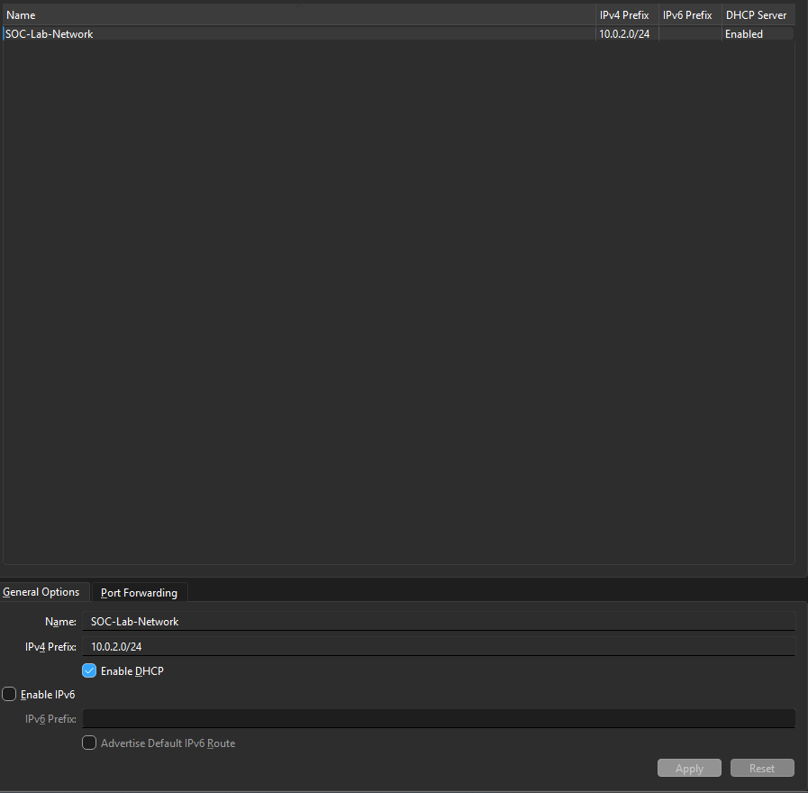
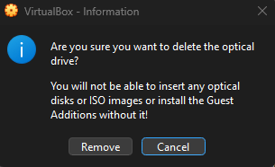
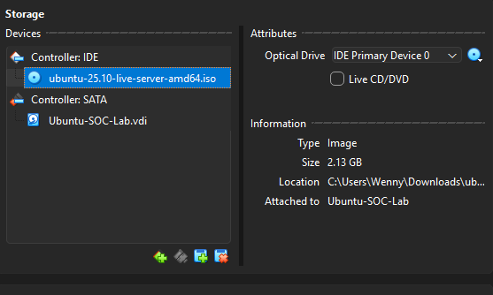

# Project Implementation & Troubleshooting Logs

### 📅 Activity Log: January 18 - 29, 2026
**Phase: Hypervisor Deployment & Virtual Infrastructure Provisioning**

#### 1. Hypervisor Installation & Remediation
* **Technical Challenge:** Initial Oracle VirtualBox 7.2.4 installation failed with a "Fatal error" due to directory permission conflicts on a secondary drive.
* **System Remediation:** Utilized **Revo Uninstaller** to purge orphaned registry entries and partial files, followed by a clean install to `C:\Program Files` with elevated Administrative privileges.
* **Optimization:** Redirected the **Default Machine Folder** to `D:\Virtual Machines` to preserve primary drive performance while allowing for scalable VM growth.

#### 2. Network Infrastructure (Lab Subnet)
* **Action:** Created a dedicated **NAT Network** named `SOC-Lab-Network`.
* **Configuration:** Assigned the `10.0.2.0/24` IPv4 prefix with DHCP enabled.
* **Evidence:**
* 
* **SOC Rationale:** Isolating lab traffic from the host OS is a fundamental security practice for malware analysis and network monitoring.

#### 3. Management Server Provisioning (soc-mgmt-01)
* **Resource Allocation:** Provisioned an Ubuntu Server VM with 2 vCPUs, 2048 MB RAM, and a 25.00 GB VDI hard disk.
* **Network Binding:** Bound the primary network adapter to the `SOC-Lab-Network` interface.

#### 4. Storage Sanitization & Risk Mitigation
* **Troubleshooting:** Identified a potential "Unattended Installation" script (aux-iso) that would have created a generic `vboxuser` account.
* **Action:** Manually detached the automated ISO and mounted `ubuntu-25.10-live-server-amd64.iso` to the IDE controller.
* **Critical Incident:** Successfully identified and bypassed a VirtualBox prompt that would have deleted the entire IDE hardware interface.
* **Evidence:** 
* 
    * 

---
**Status:** System Bootstrapped. Ready for Manual OS Installation.
